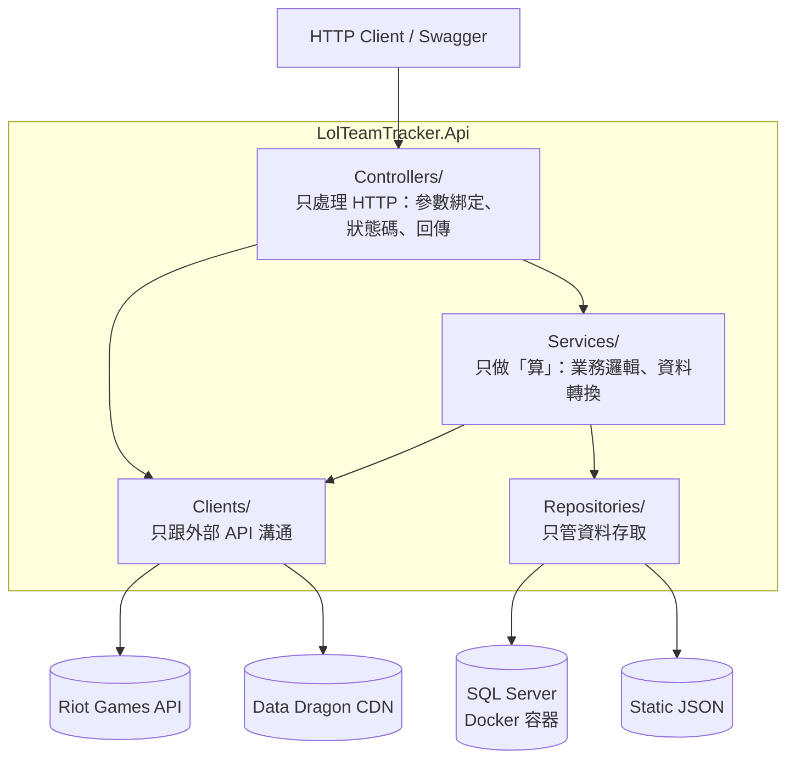

# LolTeamTracker

> 串接 Riot Games API 的英雄聯盟戰隊戰績分析後端服務，以 ASP.NET Core 8 實作。

這個專案的目的不只是「把資料撈出來」，而是拿一個會**實際失敗的外部依賴**（Riot API 有速率限制、24 小時就過期的開發金鑰、會回 404 的查詢），練習後端該有的邊界處理：錯誤怎麼分類、日誌怎麼查、職責怎麼切。

---

## 目錄

- [系統架構](#系統架構)
- [技術棧](#技術棧)
- [快速開始](#快速開始)
- [API 端點](#api-端點)
- [設計決策與 trade-off](#設計決策與-trade-off)
- [目前狀態與 Roadmap](#目前狀態與-roadmap)

---

## 系統架構

單一 Web API 專案，以資料夾分層。**依賴方向單向由上而下，且一律依賴介面而非實作。**



| 資料夾 | 職責 | 不做什麼 |
|---|---|---|
| `Controllers/` | 收參數、呼叫下一層、決定狀態碼 | 不寫商業邏輯 |
| `Clients/` | 呼叫 Riot API / Data Dragon CDN | 不做業務判斷 |
| `Services/` | 計算 KDA、CS、時區轉換、流程編排 | 不自己開 `HttpClient`、不自己讀檔 |
| `Repositories/` | 資料放哪裡、怎麼存取 | 不含業務邏輯 |
| `Models/` | DTO / Domain Model / Request Model | 不含邏輯 |
| `Validators/` | FluentValidation 規則 | — |
| `Middleware/` | 全域例外處理 | — |
| `Filters/` | 驗證結果統一攔截 | — |

**判斷職責有沒有混在一起的速查測試：** 如果一個類別的建構子同時出現 `IHttpClientFactory`（打外部 API）和 `IWebHostEnvironment`（存取檔案），代表它同時扛了兩種性質完全不同的事，就該拆。這個專案有兩個類別是照這條規則拆出來的（見下方設計決策 #1）。

---

## 技術棧

| 項目 | 選用 |
|---|---|
| Runtime | .NET 8 / ASP.NET Core Web API |
| 資料存取 | EF Core 8（Code First + Migration） |
| 資料庫 | SQL Server 2022 |
| 本機環境 | Docker Compose |
| 參數驗證 | FluentValidation 12 + 自訂 `ValidationFilter` |
| 錯誤處理 | `IExceptionHandler` + RFC 7807 `ProblemDetails` |
| 日誌 | `Microsoft.Extensions.Logging` + message template 結構化欄位 |
| 機密管理 | User Secrets（本機）／環境變數（容器） |
| API 文件 | Swashbuckle（Swagger UI + ReDoc）+ XML 註解 |
| 外部資料 | Riot Games API、Data Dragon CDN |

---

## 快速開始

### 前置需求

- [.NET 8 SDK](https://dotnet.microsoft.com/download/dotnet/8.0)
- [Docker Desktop](https://www.docker.com/products/docker-desktop/)（用於啟動 SQL Server）
- EF Core CLI：`dotnet tool install --global dotnet-ef --version 8.*`
- 一組 Riot API Key（[開發者平台](https://developer.riotgames.com/) 申請，**開發用金鑰 24 小時失效**）

### 1. 啟動資料庫

```bash
cp .env.example .env       # 填入 MSSQL_SA_PASSWORD（需含大小寫、數字、符號）
docker compose up -d
docker compose ps          # 等到 mssql 狀態為 (healthy)
```

> `.env` 已列入 `.gitignore`。密碼請避開 `#`、`$`（`.env` 的註解與變數展開符號）以及 `;`（連線字串分隔符）。

### 2. 設定機密

API Key 與連線字串 **不進版控**。`appsettings.json` 中的 `RiotApi:ApiKey` 一律留空，實際值放在下列任一處：

```bash
cd LolTeamTracker.Api
dotnet user-secrets init

dotnet user-secrets set "RiotApi:ApiKey" "RGAPI-你的金鑰"
dotnet user-secrets set "ConnectionStrings:DefaultConnection" \
  "Server=localhost,1434;Database=LolTeamTracker;User Id=sa;Password=你的密碼;TrustServerCertificate=True"
```

User Secrets 存放於專案資料夾**之外**（`%APPDATA%\Microsoft\UserSecrets\`），因此不可能誤入版控。容器與正式環境改用環境變數（`ConnectionStrings__DefaultConnection`）。

> `TrustServerCertificate=True` 是**本機開發的妥協** — Docker 內的 SQL Server 使用自簽憑證。正式環境應安裝受信任的憑證，否則等同「加密但不驗證對方身分」。

### 3. 建立資料表

```bash
dotnet ef database update
```

### 4. 啟動 API

```bash
dotnet restore
dotnet run --project LolTeamTracker.Api
```

啟動後開啟：

- Swagger UI — `https://localhost:{port}/swagger`
- ReDoc — `https://localhost:{port}/redoc`

### 戰隊名單

團隊成員資料表為 `Players`（`Puuid` 建有唯一索引）。目前資料來源仍為 `LolTeamTracker.Api/Data/Team/team.json`，**資料存取層遷移至 EF Core 的作業進行中**（見 [目前狀態與 Roadmap](#目前狀態與-roadmap)）。

---

## API 端點

### `MatchController` — 戰績分析（本服務的核心價值）

| Method | 路徑 | 說明 |
|---|---|---|
| `GET` | `/api/match/match-summaries?gameName={name}&tagLine={tag}&count={n}` | 查單一玩家近期戰績，回傳整理後的 KDA、CS、分路、遊戲模式、台灣時間 |
| `GET` | `/api/match/team-analysis` | 讀取戰隊名單，批次查詢全隊戰績 |

### `RiotController` — Riot API 代理與靜態資料

| Method | 路徑 | 說明 |
|---|---|---|
| `GET` | `/api/riot/players/{gameName}/{tagLine}` | Riot ID → puuid |
| `GET` | `/api/riot/players/{puuid}` | puuid → Riot ID |
| `GET` | `/api/riot/players/match-ids?puuid={puuid}&count={n}` | 查對戰編號列表 |
| `GET` | `/api/riot/matches/{matchId}` | 單場原始資料 |
| `GET` | `/api/riot/matches/{matchId}/timeline` | 單場時間軸 |
| `POST` | `/api/riot/download-all-json` | 從 Data Dragon 下載最新靜態資料（英雄、道具、符文、召喚師技能） |

### 錯誤回應格式

所有例外統一由 `GlobalExceptionHandler` 轉成 RFC 7807 `ProblemDetails`，並附帶 `traceId` 供日誌關聯：

```json
{
  "type": "about:blank",
  "title": "Player not found",
  "status": 404,
  "detail": "找不到玩家，請確認輸入的名稱與 TagLine 是否正確",
  "instance": "/api/match/match-summaries",
  "traceId": "00-8a3f...-01"
}
```

---

## 設計決策與 trade-off

這一節記錄的是**為什麼這樣做，以及放棄了什麼**。

### 1. 拆解 God-Class：一個類別只做一種性質的事

**問題：** `MatchAnalyzer` 原本同時做三件事——用 `HttpClient` 打 Riot API、計算 KDA/CS/時區、讀取 `team.json`。建構子同時出現 `IHttpClientFactory` 和檔案路徑，是職責混雜的明確訊號。

**做法：** 打 API 的責任移到 `IRiotApiClient`，讀檔的責任移到 `ITeamRepository`，`MatchAnalyzer` 只剩「算」。

同樣的判斷套用在 `RiotDataDownloader` 上，拆成三層：

| 拆出的類別 | 職責 |
|---|---|
| `DataDragonClient` | 只跟 CDN 要資料，回傳原始內容 |
| `StaticDataRepository` | 只負責檔案落地 |
| `StaticDataService` | 只做流程編排，依賴上述兩個介面 |

**順帶修掉的效能問題：** 原本下載四個檔案時，版本號被查了四次（總計 8 次 HTTP 請求），且用 `static string? _version` 共用可變狀態。改成整輪查一次後往下傳，HTTP 請求 **8 → 5 次**，並保證四個檔案的版本一致。

**trade-off：** 類別數量從 1 個變成 3 個，跳轉檔案的成本增加。在這個規模下是划算的——因為換掉任一層的實作（例如檔案改資料庫）不會波及其他層。但如果這是個只有兩百行、永遠不會換實作的工具程式，這樣拆就是過度設計。

**沒有做的選擇：** 沒有拆成 Clean Architecture 那種多專案結構。單一專案用資料夾分層，在目前規模下已經足夠表達分層意圖，多專案只會增加建置與跳轉成本。

### 2. 錯誤不當作資料回傳

**問題：** `download-all-json` 端點原本不管成功失敗一律回 `200 OK`，把 `ex.Message` 拼成 `"❌ 錯誤 - ..."` 字串塞進結果陣列。呼叫端必須**字串比對 emoji** 才知道有沒有失敗。

**做法：** 依實際結果分流狀態碼，並回傳結構化 DTO（`DownloadAllResult`）：

| 情況 | 狀態碼 | 理由 |
|---|---|---|
| 全部成功 | `200 OK` | — |
| 部分成功 | `207 Multi-Status` | 呼叫端可從 `FailedFiles` 得知哪幾個失敗 |
| 全部失敗 | `502 Bad Gateway` | 上游 CDN 出問題，不是本服務的 bug——用 500 會誤導維運方向 |

**原則：** Service 層失敗一律拋例外，不 `return null` 也不回錯誤字串。錯誤混進正常回傳值，呼叫端遲早會忘記檢查。

### 3. 全域例外處理：對外給安全訊息，對內留完整脈絡

`GlobalExceptionHandler` 實作 `IExceptionHandler`，依外部 API 的實際回應分流：

| Riot 回應 | 本服務回應 | 理由 |
|---|---|---|
| `404` | `404` + 「找不到玩家」 | 使用者輸入問題，訊息要能指引修正 |
| `429` | `429` + 「查詢過快」 | 速率限制，可重試 |
| `401` / `403` | **`500`** + 「系統發生未預期的錯誤」 | **金鑰過期是我方的系統問題**，不該讓呼叫端以為是自己沒權限，也不該洩漏內部狀態 |

`401 → 500` 這個轉換是刻意的：**上游的狀態碼語意，不等於本服務對呼叫端的語意。**

### 4. 驗證責任從 Controller 抽離

Controller 曾經散落 `if (string.IsNullOrEmpty(...))` 這類檢查。現在：

- 參數收斂成 Request Model（`GetMatchListRequest` 等），用 `[FromQuery]` / `[FromRoute]` 綁定
- 規則寫在 `Validators/`，共用零件放 `RuleBuilderExtensions`
- `ValidationFilter` 註冊為全域 filter，在 action 執行**之前**統一攔截

Controller 因此只剩「呼叫下一層、回傳結果」。

### 5. 結構化日誌，不用字串內插

```csharp
// 不這樣寫——訊息變成一整串，無法依欄位查詢
_logger.LogError($"查詢比賽失敗 {gameName}#{tagLine}");

// 這樣寫——GameName、TagLine、MatchId 是可查詢的獨立欄位
_logger.LogError(ex, "查詢比賽失敗。Player: {GameName}#{TagLine}, MatchId: {MatchId}",
    gameName, tagLine, matchId);
```

`TraceId` 統一採 `Activity.Current?.Id ?? httpContext.TraceIdentifier`，讓錯誤回應中的 `traceId` 能直接對回日誌。

**結構化的本質是 message template，不是輸出格式。** `{GameName}` 這類具名參數讓欄位在日誌管線中保持獨立、可被查詢；至於輸出成純文字或 JSON，只是換一個 formatter 的事，取決於接收端是人還是日誌收集系統。目前使用預設的 console 輸出。

### 6. 資料庫與 Entity 設計

**Entity 與 DTO 分離**：`Models/Entities/Player`（資料庫）與 `Models/PlayerInfo`（對外傳遞）是兩個型別，即使欄位高度重疊。

判準是同一句話：**會因為不同原因而改變的東西就該分開。** DTO 因 API 合約變動（前端要多一個欄位），Entity 因資料庫結構變動（加索引、加稽核欄位）。共用一個型別，等於讓其中一方的變動直接波及另一方。

這句話同時決定了另外兩個選擇：

| 決策 | 選擇 | 因為它們變動的原因不同 |
|---|---|---|
| 資料庫設定寫哪裡 | **Fluent API**（`OnModelCreating`），不用 Data Annotation | Entity 保持乾淨；且複合索引、filtered index 只有 Fluent API 做得到 |
| 輸入驗證寫哪裡 | **FluentValidation**（`Validators/`） | `[MaxLength]` 同時被 EF Core 與 MVC 驗證讀取，語意模糊——它到底在限制資料庫欄位還是使用者輸入？ |

**主鍵用自增 `Id`，而非 `Puuid`**：puuid 是 Riot 的永久玩家識別碼，直覺上是理想的自然鍵，但有三個問題：

1. 78 字元的寬鍵——SQL Server 的叢集索引鍵會被複製進**每一個**非叢集索引
2. 它由外部系統擁有（Riot 曾棄用 `summonerId` / `accountId` 改推 puuid）
3. 資料匯入的時序上，它未必在插入當下就已知

改用自增 `Id` 作代理鍵，`Puuid` 另建唯一索引——主鍵窄而穩定，唯一性仍由資料庫保證。

**`Puuid` 的唯一索引不只防重複，更是併發的最後防線**：新增成員的流程會先查詢 puuid 是否已存在（存在則更新名稱，處理玩家改名）。但兩個併發請求可能同時查到「不存在」而都執行插入。

> **應用層的檢查是效能優化，資料庫約束才是正確性保證。** 應用層先查是為了讓多數情況不必走到例外處理，但唯一性的最終保障只能在資料庫——只有它能序列化併發寫入。

**Migration 不直接套用於正式環境**：`dotnet ef database update` 僅用於本機。正式環境應以 `dotnet ef migrations script --idempotent` 產生 SQL 交付審核——結構變更需要留存紀錄、可回溯，且應用程式的部署身分不應具備 DDL 權限。

---

## 目前狀態與 Roadmap

誠實記錄目前的限制，以及打算怎麼處理。

| 項目 | 狀態 | 說明 |
|---|---|---|
| 分層架構 + 介面隔離 | ✅ 完成 | |
| 全域例外處理 | ✅ 完成 | |
| FluentValidation | ✅ 完成 | |
| 結構化日誌 | ✅ 完成 | |
| Docker Compose（本機） | ✅ 完成 | 一行指令啟動 SQL Server，含 healthcheck 與資料持久化 volume |
| **EF Core + SQL Server** | 🚧 進行中 | Entity、`DbContext`、Migration、資料表皆已完成；**資料存取層（`ITeamRepository` 的實作）尚未從 JSON 切換至 EF Core** |
| **單元測試** | 🔜 規劃中 | 介面已就緒，可用測試替身隔離外部 API |
| **強型別 DTO** | 🔜 規劃中 | 目前 Riot 回應以 `JsonElement` 傳遞，`GetProperty("x")` 散落在 Service 層。改成 DTO 後，欄位缺漏會在反序列化邊界就失敗，而不是在邏輯深處才 runtime 爆炸 |
| API 容器化 | 🔜 規劃中 | 目前 compose 只含資料庫，API 尚未容器化 |
| 快取（Cache-Aside） | 🔜 規劃中 | Riot API 有速率限制，重複查詢應快取 |

### 已知限制

- **Riot 開發用 API Key 24 小時失效**，過期後所有查詢會失敗（本服務會回 `500`，日誌中可見上游的 `401`）
- 團隊查詢採序列呼叫，隊員數量多時延遲會線性累加，尚未平行化或加上速率限制保護
- **`PlayerInfo` 未接住資料來源中既有的 `puuid`**，導致每次查詢戰績都重新呼叫 API 取得已知的值；隊員數 N 就是 N 次多餘請求。待資料存取層切換至 EF Core 後一併修正
- 尚未導入重試 / 熔斷機制（Polly），遇到 Riot API 暫時性失敗不會自動重試
- 尚無自動化測試

---

## 專案結構

```
LolTeamTracker.Api/
├── Clients/          # IRiotApiClient, IDataDragonClient — 外部 API 溝通
├── Controllers/      # MatchController, RiotController — HTTP 端點
├── Services/         # IMatchAnalyzer, StaticDataService — 業務邏輯與流程編排
├── Repositories/     # ITeamRepository, IStaticDataRepository — 資料存取
├── Data/             # AppDbContext（EF Core）、靜態 JSON 資料
├── Migrations/       # EF Core 自動產生，勿手動修改
├── Models/
│   ├── Entities/     # 資料庫 Entity（Player）
│   ├── Requests/     # API 輸入模型
│   └── Results/      # API 回應 DTO
├── Validators/       # FluentValidation 規則
├── Middleware/       # GlobalExceptionHandler
├── Filters/          # ValidationFilter
└── Docs/             # 架構文件與改造記錄

docker-compose.yml    # 本機開發環境（SQL Server）
.env.example          # 環境變數範本
```
