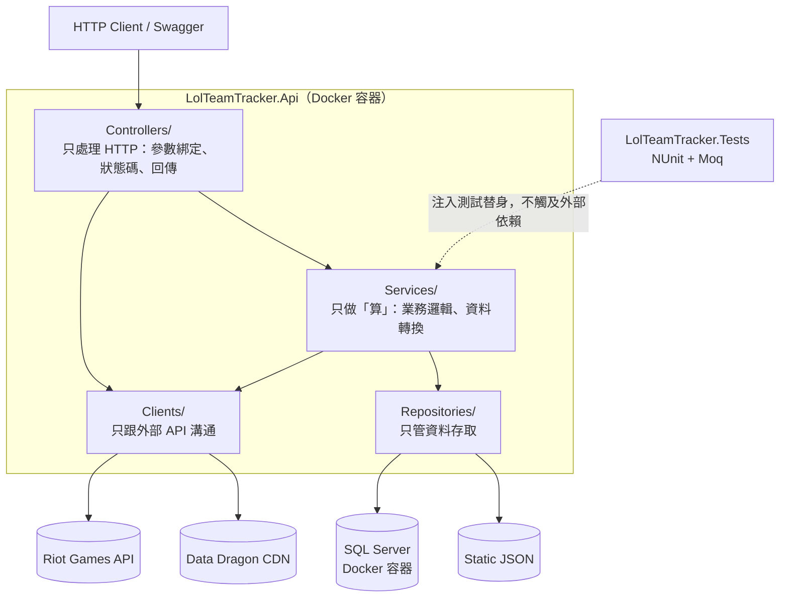

# LolTeamTracker

[](https://github.com/tn00627974/LolTeamTracker/actions/workflows/ci.yml)

> 串接 Riot Games API 的英雄聯盟戰隊戰績分析後端服務，以 ASP.NET Core 8 實作。

這個專案的目的不只是「把資料撈出來」，而是拿一個會**實際失敗的外部依賴**（Riot API 有速率限制、24 小時就過期的開發金鑰、會回 404 的查詢），練習後端該有的邊界處理：錯誤怎麼分類、日誌怎麼查、職責怎麼切。

---

## 目錄

- [系統架構](#系統架構)
- [技術棧](#技術棧)
- [快速開始](#快速開始)
- [API 端點](#api-端點)
- [設計決策與 trade-off](#設計決策與-trade-off)
- [目前狀態與 Roadmap](#目前狀態與-roadmap)

---

## 系統架構

單一 Web API 專案，以資料夾分層。**依賴方向單向由上而下，且一律依賴介面而非實作。**



| 資料夾 | 職責 | 不做什麼 |
|---|---|---|
| `Controllers/` | 收參數、呼叫下一層、決定狀態碼 | 不寫商業邏輯 |
| `Clients/` | 呼叫 Riot API / Data Dragon CDN | 不做業務判斷 |
| `Services/` | 計算 KDA、CS、時區轉換、流程編排 | 不自己開 `HttpClient`、不自己讀檔 |
| `Repositories/` | 資料放哪裡、怎麼存取 | 不含業務邏輯 |
| `Models/` | DTO / Domain Model / Request Model | 不含邏輯 |
| `Validators/` | FluentValidation 規則 | — |
| `Middleware/` | 全域例外處理 | — |
| `Filters/` | 驗證結果統一攔截 | — |

**判斷職責有沒有混在一起的速查測試：** 如果一個類別的建構子同時出現 `IHttpClientFactory`（打外部 API）和 `IWebHostEnvironment`（存取檔案），代表它同時扛了兩種性質完全不同的事，就該拆。這個專案有兩個類別是照這條規則拆出來的（見下方設計決策 #1）。

---

## 技術棧

| 項目 | 選用 |
|---|---|
| Runtime | .NET 8 / ASP.NET Core Web API |
| 資料存取 | EF Core 8（Code First + Migration） |
| 資料庫 | SQL Server 2022 |
| 容器化 | Dockerfile（multi-stage build）+ Docker Compose |
| CI | GitHub Actions（build + 測試 + 映像建置驗證，含 SQL Server service container） |
| 測試 | NUnit 3.14 + Moq 4.20（單元）、`Microsoft.AspNetCore.Mvc.Testing`（整合） |
| 參數驗證 | FluentValidation 12 + 自訂 `ValidationFilter` |
| 錯誤處理 | `IExceptionHandler` + RFC 7807 `ProblemDetails` |
| 日誌 | `Microsoft.Extensions.Logging` + message template 結構化欄位 |
| 機密管理 | User Secrets（本機）／環境變數（容器） |
| API 文件 | Swashbuckle（Swagger UI + ReDoc）+ XML 註解 |
| 外部資料 | Riot Games API、Data Dragon CDN |

---

## 快速開始

### 前置需求

- [Docker Desktop](https://www.docker.com/products/docker-desktop/) — 啟動 API 與 SQL Server
- [.NET 8 SDK](https://dotnet.microsoft.com/download/dotnet/8.0) — 建立資料表、跑測試、本機開發時需要
- EF Core CLI：`dotnet tool install --global dotnet-ef --version 8.*`
- 一組 Riot API Key（[開發者平台](https://developer.riotgames.com/) 申請，**開發用金鑰 24 小時失效**）

### 1. 填入環境變數

```bash
cp .env.example .env
```

填入 `MSSQL_SA_PASSWORD` 與 `RIOT_API_KEY`。

> `.env` 已列入 `.gitignore`，且**不會進入映像**。密碼請避開 `#`、`$`（`.env` 的註解與變數展開符號）以及 `;`（連線字串分隔符）。

### 2. 啟動（API + SQL Server）

```bash
docker compose up -d --build
docker compose ps            # 兩個服務都要 Up，mssql 需為 (healthy)
```

`api` 服務會等到 `mssql` 通過 healthcheck 才啟動（`depends_on` + `condition: service_healthy`）——「容器已啟動」不等於「資料庫可接受連線」，SQL Server 冷啟動約需十餘秒。

### 3. 建立資料表（僅首次）

Migration **不會**在容器啟動時自動執行（理由見 [設計決策 #8](#8-容器化把環境差異擋在映像之外)）。首次啟動需從主機執行一次：

```bash
cd LolTeamTracker.Api
dotnet user-secrets init
dotnet user-secrets set "ConnectionStrings:DefaultConnection" \
  "Server=localhost,1434;Database=LolTeamTracker;User Id=sa;Password=你的密碼;TrustServerCertificate=True"

dotnet ef database update
```

> 注意 `Server=localhost,1434`——這是**從主機連**的位址。API 容器內部走的是 `Server=mssql,1433`（compose 服務名 + 容器內部 port），兩者指向同一個資料庫。

### 4. 灌入資料（選用）

`Scripts/` 下有腳本，**執行順序不能顛倒**——外鍵依賴決定了先後：

```
seed-queue-definitions.sql  →  Matches 的 QueueId 外鍵指向它
seed-players.sql            →  MatchPlayers 的 PlayerId 外鍵指向它
seed-test-data.sql          →  10 萬場比賽 / 約 25 萬列參與紀錄
```

```powershell
# 從 .env 讀密碼，避免寫在指令列留下歷史紀錄
$pw = ((Get-Content .env | Where-Object { $_ -match '^MSSQL_SA_PASSWORD=' }) -replace '^MSSQL_SA_PASSWORD=','')

docker cp Scripts/seed-queue-definitions.sql lolteamtracker-mssql:/tmp/
docker cp Scripts/seed-players.sql           lolteamtracker-mssql:/tmp/
docker cp Scripts/seed-test-data.sql         lolteamtracker-mssql:/tmp/

docker exec lolteamtracker-mssql /opt/mssql-tools18/bin/sqlcmd -S localhost -U sa -P "$pw" -C -d LolTeamTracker -i /tmp/seed-queue-definitions.sql
docker exec lolteamtracker-mssql /opt/mssql-tools18/bin/sqlcmd -S localhost -U sa -P "$pw" -C -d LolTeamTracker -i /tmp/seed-players.sql
docker exec lolteamtracker-mssql /opt/mssql-tools18/bin/sqlcmd -S localhost -U sa -P "$pw" -C -d LolTeamTracker -i /tmp/seed-test-data.sql
```

| 腳本 | 性質 | 正式環境能跑嗎 |
|---|---|---|
| `seed-queue-definitions.sql` | **參照資料**（模式對照表） | ✅ 冪等新增，不刪任何東西 |
| `seed-players.sql` | 測試資料（10 筆成員） | ⚠️ 僅開發用 |
| `seed-test-data.sql` | 測試資料（25 萬列） | ❌ 會 TRUNCATE，有 `DB_NAME()` 檢查擋著 |

> **為什麼結構走 Migration、資料走 SQL 腳本**：結構要版控、要能重現、要可回溯，這是 Migration 的職責；25 萬列的測試資料用 EF 的 `HasData` 並不合適。而參照資料與測試資料分成兩支腳本，用的是同一把尺——**參照資料正式環境必須有（沒有它模式名稱翻不出來），測試資料正式環境絕對不能有。**

驗證資料量：

```sql
SELECT 'QueueDefinitions' AS T, COUNT(*) FROM QueueDefinitions
UNION ALL SELECT 'Players',      COUNT(*) FROM Players
UNION ALL SELECT 'Matches',      COUNT(*) FROM Matches
UNION ALL SELECT 'MatchPlayers', COUNT(*) FROM MatchPlayers;
```

`Scripts/check-index-stats.sql` 可檢視索引的頁數、每列大小、碎片率——用來驗證涵蓋索引是否生效（見 [設計決策 #6](#6-資料庫與-entity-設計)）。

### 5. 開啟

- Swagger UI — <http://localhost:8080/swagger>
- ReDoc — <http://localhost:8080/redoc>

---

### 本機開發模式（不透過容器跑 API）

改程式時通常只用容器跑資料庫，API 直接在主機執行以便中斷點除錯：

```bash
docker compose up -d mssql       # 只起資料庫

cd LolTeamTracker.Api
dotnet user-secrets set "RiotApi:ApiKey" "RGAPI-你的金鑰"
dotnet run
```

此模式的機密來自 **User Secrets**（`%APPDATA%\Microsoft\UserSecrets\`），位於專案資料夾**之外**，因此不可能誤入版控。容器模式則改用環境變數（`ConnectionStrings__DefaultConnection`、`RiotApi__ApiKey`）——同一個組態鍵，不同來源。

> `TrustServerCertificate=True` 是**本機開發的妥協** — Docker 內的 SQL Server 使用自簽憑證。正式環境應安裝受信任的憑證，否則等同「加密但不驗證對方身分」。

### 執行測試

```bash
docker compose up -d mssql   # 整合測試需要真實資料庫
dotnet test
```

14 個測試分成兩種性質，**它們對環境的需求完全不同**：

| | 數量 | 外部依賴 | 驗證什麼 |
|---|---|---|---|
| 單元測試 | 13 | 無 —— `IRiotApiClient` 由 Moq 取代 | 商業邏輯：KDA 解析、時區轉換、批次容錯 |
| 整合測試 | 1 | **真實 SQL Server** | Mock 測不到的：EF Core 產生的 SQL、資料庫約束擋不擋得住併發 |

連線字串**不需要手動設定**：`TestWebApplicationFactory` 依序嘗試環境變數 `LOLTEAMTRACKER_TEST_DB`（CI 由 GitHub Secrets 注入）與專案根目錄的 `.env`（本機，與 docker compose 共用同一份密碼）。測試資料庫是獨立的 `LolTeamTracker_Test`，不會動到開發用的資料。

CI 上則由 GitHub Actions 的 service container 提供 SQL Server（見 [`.github/workflows/ci.yml`](.github/workflows/ci.yml)）。代價是 CI 從 37 秒變成約 2 分鐘 —— 換來的是「EF Core 產的 SQL 對不對」這件事每次推送都被驗證。

### 資料表

| 表 | 用途 | 關鍵約束 |
|---|---|---|
| `Players` | 戰隊成員 | `Puuid` 唯一索引；`(GameName, TagLine)` 唯一索引 |
| `Matches` | 一場比賽本身（時間、模式、時長） | 主鍵是 Riot 的場次編號（自然鍵） |
| `MatchPlayers` | 某位玩家在某場的表現（KDA、補刀、金錢） | `(MatchId, PlayerId)` 唯一索引防重複匯入；`(PlayerId, GameDate)` 服務「最近 N 場」查詢 |
| `QueueDefinitions` | 遊戲模式對照表（queueId → 名稱） | 主鍵由 Riot 定義（420、440…），不自動遞增 |

資料存取層已由 JSON 檔案切換至 EF Core（`EfTeamRepository`），成員可透過 `PUT /api/team/members` 新增或更新。

---

## API 端點

### `MatchController` — 戰績分析（本服務的核心價值）

| Method | 路徑 | 說明 |
|---|---|---|
| `GET` | `/api/match/match-summaries?gameName={name}&tagLine={tag}&count={n}` | 查單一玩家近期戰績，回傳整理後的 KDA、CS、分路、遊戲模式、台灣時間 |
| `GET` | `/api/match/team-analysis` | 讀取 `Players` 資料表的成員名單，批次查詢全隊戰績 |

兩個端點都是**批次查詢**，個別場次失敗不中斷整批作業，狀態碼依實際結果分流：

| 情況 | 狀態碼 |
|---|---|
| 全部成功 | `200 OK` |
| 部分成功 | `207 Multi-Status` |
| 全部失敗 | `502 Bad Gateway` |

回應主體為 `MatchSummaryResult`：

```json
{
  "matchSummaryList": [ { "champion": "Ahri", "kills": 10, "totalCS": 200, "...": "..." } ],
  "successCount": 8,
  "failedCount": 2
}
```

> `failedCount` 存在的理由：失敗的場次不會出現在 `matchSummaryList` 裡，若不另外回報，呼叫端拿到 8 筆時無從得知原本應有 10 筆。**不中斷 ≠ 不告知**（見 [設計決策 #2](#2-錯誤不當作資料回傳)）。

### `TeamController` — 戰隊名單維護

| Method | 路徑 | 說明 |
|---|---|---|
| `GET` | `/api/team/me` | 查詢戰隊成員名單（`GameName` / `TagLine`）。名單為空時回 `200` 與空陣列 |
| `PUT` | `/api/team/members` | 以 Riot ID 新增成員；已存在則更新名稱。成功回 `204 No Content` |

> 用 `PUT` 而非 `POST`：本操作**冪等**——以相同參數呼叫多次的結果，與呼叫一次相同，因此重試是安全的。回 `204` 而非 `200`，因為沒有內容可回，`200` 在語意上暗示 body 有東西。

> 查無成員時回 `200` 與 `[]`，不是 `404`：「集合是空的」與「這個資源不存在」是不同的事，用 `404` 會讓呼叫端誤判成路徑寫錯。

### `MatchStatsController` — 比賽統計分析

| Method | 路徑 | 說明 |
|---|---|---|
| `GET` | `/api/matchstats/top-champions` | 每位成員最常玩的前三個英雄 |
| `GET` | `/api/matchstats/best-combo-per-player` | 每位成員勝率最高的「英雄 + 路線」組合 |
| `GET` | `/api/matchstats/best-champion-per-lane` | 每條路線勝率最高的英雄（樣本數 < 500 場不列入排名） |

> **樣本門檻的理由**：比率型指標若不設下限，「打 1 場贏 1 場」會以 100% 勝率排在「打 3000 場贏 55%」之前。門檻要隨分組粒度調整——粒度越細，每組樣本越少。

> **統計計算放在 `Repositories/` 而非 `Services/`**：判準是「這個計算能否脫離資料庫語法、單獨在 C# 重寫一份」。KDA 可以（拿到原始數字就能算）；英雄排名不行——25 萬列不可能全部載入記憶體，`GROUP BY` 與聚合必須發生在資料庫端，計算邏輯與查詢語法綁在一起。

> **已知限制**：`RANK() OVER (PARTITION BY ...)` 無法被 EF Core 翻譯成 SQL，因此「每組取前 N 名」這一步是在 `ToList()` 之後於記憶體中完成。資料庫回傳的是「玩家 × 英雄」的完整組合而非最終的 30 列。以目前 10 位成員的規模可接受，資料量增長後應改用原生 SQL 或 `FromSqlRaw`。

### `RiotController` — Riot API 代理與靜態資料

| Method | 路徑 | 說明 |
|---|---|---|
| `GET` | `/api/riot/players/{gameName}/{tagLine}` | Riot ID → puuid |
| `GET` | `/api/riot/players/{puuid}` | puuid → Riot ID |
| `GET` | `/api/riot/players/match-ids?puuid={puuid}&count={n}` | 查對戰編號列表 |
| `GET` | `/api/riot/matches/{matchId}` | 單場原始資料 |
| `GET` | `/api/riot/matches/{matchId}/timeline` | 單場時間軸 |
| `POST` | `/api/riot/download-all-json` | 從 Data Dragon 下載最新靜態資料（英雄、道具、符文、召喚師技能） |

### 錯誤回應格式

所有例外統一由 `GlobalExceptionHandler` 轉成 RFC 7807 `ProblemDetails`，並附帶 `traceId` 供日誌關聯：

```json
{
  "type": "about:blank",
  "title": "Player not found",
  "status": 404,
  "detail": "找不到玩家，請確認輸入的名稱與 TagLine 是否正確",
  "instance": "/api/match/match-summaries",
  "traceId": "00-8a3f...-01"
}
```

---

## 設計決策與 trade-off

這一節記錄的是**為什麼這樣做，以及放棄了什麼**。

### 1. 拆解 God-Class：一個類別只做一種性質的事

**問題：** `MatchAnalyzer` 原本同時做三件事——用 `HttpClient` 打 Riot API、計算 KDA/CS/時區、讀取 `team.json`。建構子同時出現 `IHttpClientFactory` 和檔案路徑，是職責混雜的明確訊號。

**做法：** 打 API 的責任移到 `IRiotApiClient`，讀檔的責任移到 `ITeamRepository`，`MatchAnalyzer` 只剩「算」。

同樣的判斷套用在 `RiotDataDownloader` 上，拆成三層：

| 拆出的類別 | 職責 |
|---|---|
| `DataDragonClient` | 只跟 CDN 要資料，回傳原始內容 |
| `StaticDataRepository` | 只負責檔案落地 |
| `StaticDataService` | 只做流程編排，依賴上述兩個介面 |

**順帶修掉的效能問題：** 原本下載四個檔案時，版本號被查了四次（總計 8 次 HTTP 請求），且用 `static string? _version` 共用可變狀態。改成整輪查一次後往下傳，HTTP 請求 **8 → 5 次**，並保證四個檔案的版本一致。

**trade-off：** 類別數量從 1 個變成 3 個，跳轉檔案的成本增加。在這個規模下是划算的——因為換掉任一層的實作（例如檔案改資料庫）不會波及其他層。但如果這是個只有兩百行、永遠不會換實作的工具程式，這樣拆就是過度設計。

**沒有做的選擇：** 沒有拆成 Clean Architecture 那種多專案結構。單一專案用資料夾分層，在目前規模下已經足夠表達分層意圖，多專案只會增加建置與跳轉成本。

### 2. 錯誤不當作資料回傳

**問題：** `download-all-json` 端點原本不管成功失敗一律回 `200 OK`，把 `ex.Message` 拼成 `"❌ 錯誤 - ..."` 字串塞進結果陣列。呼叫端必須**字串比對 emoji** 才知道有沒有失敗。

**做法：** 依實際結果分流狀態碼，並回傳結構化 DTO（`DownloadAllResult`）：

| 情況 | 狀態碼 | 理由 |
|---|---|---|
| 全部成功 | `200 OK` | — |
| 部分成功 | `207 Multi-Status` | 呼叫端可從 `FailedFiles` 得知哪幾個失敗 |
| 全部失敗 | `502 Bad Gateway` | 上游 CDN 出問題，不是本服務的 bug——用 500 會誤導維運方向 |

**原則：** Service 層失敗一律拋例外，不 `return null` 也不回錯誤字串。錯誤混進正常回傳值，呼叫端遲早會忘記檢查。

**「不中斷」與「不告知」是兩件事。** 同一條原則後來回頭檢驗了 `MatchAnalyzer`，得出不同結論：

批次查詢十場比賽，其中一場失敗時**不應**中斷整批——這與上述原則不衝突，因為「單一場次失敗」和「整個查詢失敗」是不同粒度的事件。金融或批次系統若讓一筆壞資料拖垮整批作業，代價遠高於跳過它。

但原本的實作只做到「不中斷」：例外被 `catch` 後僅記錄日誌，方法回傳 `List<MatchSummary>`。呼叫端拿到 8 筆時，**無從得知原本應有 10 筆**——失敗資訊只存在於日誌，沒有進入回傳值。這才是真正的「錯誤被吞掉」。

改為回傳 `MatchSummaryResult`（含 `FailedCount`）後，兩個 `MatchController` 端點才得以比照 `download-all-json` 做狀態碼分流。

> 值得記錄的是判準的一致性：`DownloadAllResult` 保留 `SuccessFiles` 是必要的（下載成功後內容寫入磁碟，回傳值裡只剩檔名）；`MatchSummaryResult` 就不需要對應欄位，因為成功的內容本身就在 `MatchSummaryList` 裡。**同一個欄位在不同情境下一個必要、一個冗餘，判準是「這份資訊還有沒有別的地方能拿到」。**

### 3. 全域例外處理：對外給安全訊息，對內留完整脈絡

`GlobalExceptionHandler` 實作 `IExceptionHandler`，依外部 API 的實際回應分流：

| Riot 回應 | 本服務回應 | 理由 |
|---|---|---|
| `404` | `404` + 「找不到玩家」 | 使用者輸入問題，訊息要能指引修正 |
| `429` | `429` + 「查詢過快」 | 速率限制，可重試 |
| `401` / `403` | **`500`** + 「系統發生未預期的錯誤」 | **金鑰過期是我方的系統問題**，不該讓呼叫端以為是自己沒權限，也不該洩漏內部狀態 |

`401 → 500` 這個轉換是刻意的：**上游的狀態碼語意，不等於本服務對呼叫端的語意。**

### 4. 驗證責任從 Controller 抽離

Controller 曾經散落 `if (string.IsNullOrEmpty(...))` 這類檢查。現在：

- 參數收斂成 Request Model（`GetMatchListRequest` 等），用 `[FromQuery]` / `[FromRoute]` 綁定
- 規則寫在 `Validators/`，共用零件放 `RuleBuilderExtensions`
- `ValidationFilter` 註冊為全域 filter，在 action 執行**之前**統一攔截

Controller 因此只剩「呼叫下一層、回傳結果」。

### 5. 結構化日誌，不用字串內插

```csharp
// 不這樣寫——訊息變成一整串，無法依欄位查詢
_logger.LogError($"查詢比賽失敗 {gameName}#{tagLine}");

// 這樣寫——GameName、TagLine、MatchId 是可查詢的獨立欄位
_logger.LogError(ex, "查詢比賽失敗。Player: {GameName}#{TagLine}, MatchId: {MatchId}",
    gameName, tagLine, matchId);
```

`TraceId` 統一採 `Activity.Current?.Id ?? httpContext.TraceIdentifier`，讓錯誤回應中的 `traceId` 能直接對回日誌。

**結構化的本質是 message template，不是輸出格式。** `{GameName}` 這類具名參數讓欄位在日誌管線中保持獨立、可被查詢；至於輸出成純文字或 JSON，只是換一個 formatter 的事，取決於接收端是人還是日誌收集系統。目前使用預設的 console 輸出。

### 6. 資料庫與 Entity 設計

**Entity 與 DTO 分離**：`Models/Entities/Player`（資料庫）與 `Models/PlayerInfo`（對外傳遞）是兩個型別，即使欄位高度重疊。

判準是同一句話：**會因為不同原因而改變的東西就該分開。** DTO 因 API 合約變動（前端要多一個欄位），Entity 因資料庫結構變動（加索引、加稽核欄位）。共用一個型別，等於讓其中一方的變動直接波及另一方。

這句話同時決定了另外兩個選擇：

| 決策 | 選擇 | 因為它們變動的原因不同 |
|---|---|---|
| 資料庫設定寫哪裡 | **Fluent API**（`OnModelCreating`），不用 Data Annotation | Entity 保持乾淨；且複合索引、filtered index 只有 Fluent API 做得到 |
| 輸入驗證寫哪裡 | **FluentValidation**（`Validators/`） | `[MaxLength]` 同時被 EF Core 與 MVC 驗證讀取，語意模糊——它到底在限制資料庫欄位還是使用者輸入？ |

**主鍵用自增 `Id`，而非 `Puuid`**：puuid 是 Riot 的永久玩家識別碼，直覺上是理想的自然鍵，但有三個問題：

1. 78 字元的寬鍵——SQL Server 的叢集索引鍵會被複製進**每一個**非叢集索引
2. 它由外部系統擁有（Riot 曾棄用 `summonerId` / `accountId` 改推 puuid）
3. 資料匯入的時序上，它未必在插入當下就已知

改用自增 `Id` 作代理鍵，`Puuid` 另建唯一索引——主鍵窄而穩定，唯一性仍由資料庫保證。

**`Puuid` 的唯一索引不只防重複，更是併發的最後防線**：新增成員的流程會先查詢 puuid 是否已存在（存在則更新名稱，處理玩家改名）。但兩個併發請求可能同時查到「不存在」而都執行插入。

> **應用層的檢查是效能優化，資料庫約束才是正確性保證。** 應用層先查是為了讓多數情況不必走到例外處理，但唯一性的最終保障只能在資料庫——只有它能序列化併發寫入。

**Migration 不直接套用於正式環境**：`dotnet ef database update` 僅用於本機。正式環境應以 `dotnet ef migrations script --idempotent` 產生 SQL 交付審核——結構變更需要留存紀錄、可回溯，且應用程式的部署身分不應具備 DDL 權限。

#### 比賽資料表：四個取捨

**① 拆成 `Matches` 與 `MatchPlayers`，而非一張表存 JSON**

Riot 的回應本身就分兩層：`info`（開賽時間、模式——一場一個）與 `participants[]`（KDA、補刀——一場十個）。塞進同一張表，同一場的 `GameDate` 會重複十次，且十份有機會不一致。

曾考慮過只存 `(MatchId, 原始 JSON)` 當快取。**放棄的理由是：JSON 欄位無法 `WHERE`、無法建索引，`RANK() OVER (PARTITION BY ...)` 根本寫不出來。** 快取與分析是兩個需求，前者要「一坨就好」，後者要「拆成欄位」——它們會因為不同的原因而改變。

**② `Matches` 用自然鍵，`Players` 用代理鍵——同一把尺，不同的結論**

`Matches.Id` 直接使用 Riot 的場次編號。判準不是「自然鍵好或壞」，而是**這個值會不會變、寫入當下在不在**：比賽是已發生的歷史事實，兩者都滿足；puuid 是外部系統對「人」的當前識別，兩者都不滿足。

**③ `MatchPlayers` 反正規化一份 `GameDate`**

「查某人最近 20 場」需要 `ORDER BY GameDate`，但該欄位原本只在 `Matches`——排序得先 JOIN 完整個結果集才能取前 20 筆。在 `MatchPlayers` 複製一份，讓 `(PlayerId, GameDate)` 索引直接服務排序。

> 反正規化的風險是兩份資料不同步，而**危險程度取決於那個欄位會不會變**。比賽時間寫入後永不更新，風險不存在；若複製的是 `Player.GameName`（會改名）就是災難。

**④ 兩個索引，兩種性質**

| 索引 | 性質 | Unique |
|---|---|---|
| `(MatchId, PlayerId)` | **正確性**——同一場的同一個人只能有一筆，重複代表匯入邏輯有 bug | ✅ |
| `(PlayerId, GameDate)` | **效能**——讓「最近 N 場」不必排序，讀 20 筆就停 | ❌ |

判準是：**這個組合重複了，是不是一定是 bug？** 是，才用唯一約束擋；不是（例如兩場比賽時間戳碰撞），就不該讓它中斷整批寫入。

欄位順序也不是隨意的——索引是排好序的清單，`PlayerId` 必須在最左，同一位玩家的資料才會連續躺在一起。反過來寫成 `(GameDate, PlayerId)`，該玩家的資料會散落在整份索引各處，等同索引失效（**最左前綴原則**）。

### 7. 測試：以介面邊界隔離外部依賴

**為什麼這個專案非測不可**：Riot 的開發用金鑰 24 小時失效，且 API 有速率限制。任何直接呼叫真實 API 的測試，隔天必定變成偽陽性失敗——**不穩定的測試比沒有測試更糟，因為團隊會開始習慣忽略紅燈。**

`MatchAnalyzer` 只依賴 `IRiotApiClient` 介面，因此測試時用 Moq 給它一份固定的 JSON 回應即可：

```csharp
mockRiotApiClient
    .Setup(x => x.GetMatchSummaryAsync(It.IsAny<string>()))
    .ReturnsAsync(matchData);          // 固定 fixture，不連網路
```

這是抽介面的**第二次回報**。第一次是換掉 `ITeamRepository` 的實作（JSON → EF Core）時，`git diff --stat` 顯示改動不曾越過 `Repositories/`；這次證明「換成假的實作」同樣不需要動被測程式一行。

**期望值一律寫成人工算好的常數，不在測試裡重算。** 時區轉換的斷言是：

```csharp
Assert.That(result!.GameDate, Is.EqualTo("2024/08/06 16:00:00"));
```

而不是在測試裡重跑一次 `TimeZoneInfo.ConvertTimeFromUtc(...)`。後者叫 **self-fulfilling test**——期望值用跟被測程式相同的邏輯算出來，被測邏輯改錯時期望值會跟著錯，測試永遠綠燈。**綠燈但驗不到東西，比紅燈危險，因為它提供的是虛假的安全感。**

**目前覆蓋範圍（誠實列出）**：13 個單元測試涵蓋 `MatchAnalyzer` 的欄位解析、CS 計算與時區轉換；1 個整合測試以 `WebApplicationFactory` 接真實 SQL Server。`Controllers/`、`GlobalExceptionHandler` 尚無測試。

**為什麼還需要整合測試**：Moq 假造的 Repository 沒有唯一索引，也沒有併發寫入的概念——**要驗證的東西根本不在 mock 裡面**。那個測試讓兩個獨立的 `DbContext` 同時 upsert 相同的 puuid，斷言資料庫擋下第二筆（`DbUpdateException`，內層 `SqlException.Number` 為 2601/2627），且表中最終只有一列。

> 這是在證明 README 裡反覆出現的那句話不是紙上談兵：**應用層的檢查是效能優化，資料庫約束才是正確性保證。** `UpsertPlayerAsync` 裡的 `if (player == null)` 在併發下兩邊都會判定「不存在」，真正擋住重複寫入的是唯一索引。

**覆蓋率高不等於測得夠。** `GetLaneName` 的六個 `[TestCase]` 全綠、`default` 分支也被涵蓋，但真實資料裡大亂鬥的 `teamPosition` 是**空字串**，這個輸入從未被試過，直到容器跑起來看實際回應才發現輸出成了「未知路線 ()」。覆蓋率量的是**哪幾行程式碼被執行**，不是**哪些輸入被試過**——同一行程式碼餵不同的值會有不同結果，工具看起來卻一模一樣。修正後空字串已獨立成一個 case（「Riot 沒給值」與「給了值但不認得」是兩種該分開處理的情況），並補上對應測試。

### 8. 容器化：把環境差異擋在映像之外

**Multi-stage build**：`sdk:8.0` 負責建置，最終映像用 `aspnet:8.0`——編譯器、SDK 與原始碼都不會進入執行環境。`.csproj` 先單獨 `COPY` 再 `restore`，讓套件還原這層能被 layer cache 命中，改一行程式碼不必重新下載套件。

**機密一律不進映像。** `.dockerignore` 排除 `.env` 與 `appsettings.Development.json`，API Key 與連線字串只能從環境變數注入。

> 這不只是資安考量，更是**「同一份映像跑遍所有環境」的前提**。機密一旦烤進映像，測試機與正式機就必須各建一份，容器化最大的價值就沒了。傳遞鏈是：`.env` →（compose 做字串替換）→ 容器環境變數 → ASP.NET Core 組態的第 4 層。`.env` 本身從未進入容器。

**時區資料庫需另行安裝。** `TimeZoneInfo.FindSystemTimeZoneById("Taipei Standard Time")` 使用 Windows 格式的時區 ID，原本預期在 Linux 容器中會失敗，**實測結果是可以正常運作**——.NET 6 起在 Unix 上同時接受 Windows 與 IANA 兩種 ID，透過 ICU 對應。真正的必要條件是映像內要有時區資料庫，而 `mcr.microsoft.com/dotnet/aspnet` 預設不含，因此 Dockerfile 中安裝了 `tzdata`。

> 值得記錄的是它**不會靜默退回 UTC**——對應不到就直接拋 `TimeZoneNotFoundException`。所以「查詢回 200」本身即可證明對應成功，不需要另外比對時間值。

**Migration 不在容器啟動時自動執行。** 可以在 `Program.cs` 呼叫 `Database.Migrate()` 讓應用程式自行套用結構變更，但這代表**應用程式的執行身分需具備 DDL 權限**，且多個實例同時啟動時會競爭。本專案維持手動執行；正式環境的做法見 [設計決策 #6](#6-資料庫與-entity-設計)。

---

## 目前狀態與 Roadmap

誠實記錄目前的限制，以及打算怎麼處理。

| 項目 | 狀態 | 說明 |
|---|---|---|
| 分層架構 + 介面隔離 | ✅ 完成 | |
| 全域例外處理 | ✅ 完成 | |
| FluentValidation | ✅ 完成 | |
| 結構化日誌 | ✅ 完成 | |
| **EF Core + SQL Server** | ✅ 完成 | Entity、`DbContext`、Migration、資料表完成；`ITeamRepository` 的實作已由 JSON 切換至 `EfTeamRepository` |
| **API 容器化** | ✅ 完成 | Multi-stage Dockerfile；`docker compose up -d --build` 一行啟動 API + SQL Server，含 healthcheck、啟動順序控制與資料持久化 volume |
| **測試** | 🚧 進行中 | 13 個單元測試（NUnit + Moq）涵蓋 `MatchAnalyzer`；1 個整合測試接真實 SQL Server 驗證唯一索引擋得住併發寫入。`Controllers/`、`GlobalExceptionHandler` 尚無測試 |
| **比賽資料落地** | 🚧 進行中 | `Matches` / `MatchPlayers` / `QueueDefinitions` 三張表、三個外鍵與兩個索引已建立；寫入邏輯與統計查詢尚未實作 |
| **強型別 DTO** | 🔜 規劃中 | 目前 Riot 回應以 `JsonElement` 傳遞，`GetProperty("x")` 散落在 Service 層。改成 DTO 後，欄位缺漏會在反序列化邊界就失敗，而不是在邏輯深處才 runtime 爆炸 |
| **CI（GitHub Actions）** | ✅ 完成 | 兩個 job：`restore` → `build` → `test`（Release，含 SQL Server service container），以及 Dockerfile 建置驗證。push 與 pull request 皆觸發 |
| 快取（Cache-Aside） | 🔜 規劃中 | Riot 的限制是 **100 requests / 2 minutes**。一次團隊分析（10 人 × 每人 20 場）需要 210 次請求，光打 API 就要約 4 分鐘——**這是比賽資料必須落地的直接原因**，不是為了做而做 |
| 非同步平行化 + 限流 | 🔜 規劃中 | 目前是序列 `foreach`，延遲線性累加（單次請求實測約 246ms）。去重可把 210 次降到約 110 次、平行化再把 27 秒壓到 3 秒——**兩者解決的是不同的瓶頸，順序不能顛倒**：請求數超過配額時，平行化毫無幫助 |

### 已知限制

- **Riot 開發用 API Key 24 小時失效**，過期後所有查詢會失敗（本服務會回 `500`，日誌中可見上游的 `401`）
- 團隊查詢採序列呼叫，隊員數量多時延遲會線性累加，尚未平行化或加上速率限制保護
- **`PlayerInfo` 未接住資料庫中既有的 `Puuid`**，導致每次查詢戰績都重新呼叫 API 取得已知的值；隊員數 N 就是 N 次多餘請求
- **`Puuid` 並非永久識別碼**。實測發現既有六筆資料的 puuid 全部與現行查詢結果不符（同一支金鑰重查得到相同新值，可排除「與金鑰綁定」的假設），推測 Riot 曾做過系統性遷移。因此 `Puuid` 在本專案的定位是**可能過期的快取**，真正的身分是自增 `Id`；upsert 會先以 puuid 查詢，找不到再以 `GameName + TagLine` 查詢並更新 puuid
- 尚未導入重試 / 熔斷機制（Polly），遇到 Riot API 暫時性失敗不會自動重試
- 測試涵蓋 `MatchAnalyzer` 與 `EfTeamRepository` 的併發寫入，但**實際的 HTTP 管線（路由、`ValidationFilter`、`GlobalExceptionHandler`）仍未被覆蓋**——現有的整合測試直接從 DI 容器解析 `ITeamRepository`，繞過了整條 middleware pipeline。要涵蓋那一層需改用 `_factory.CreateClient()` 打真實端點
- **`Data/Static/` 的靜態資料存在容器可寫層**，容器重建即遺失，需重新呼叫 `download-all-json`。目前刻意不掛 volume——這份資料隨時可從 Data Dragon 重新取得，性質上是快取而非需要保全的資料，代價是換取容器的無狀態性
- **容器僅提供 HTTP（`8080`），無 HTTPS**。容器內沒有開發憑證，TLS 終結應由反向代理或雲端平台負責，這是容器化服務的常見做法
- **只有 CI，尚未實作 CD**。workflow 驗證 build / test / 映像建置，但不部署。未做線上部署的主因是 Riot 的開發用金鑰 24 小時失效，公開 demo 隔天即失效；要提供穩定的 demo 需先實作一個回傳固定 fixture 的 `IRiotApiClient` 替代實作，以環境變數切換
- **現行 CI 是「通知」而非「門禁」**。`on: push` 在推送發生**之後**才觸發，擋不住任何東西；PR 上的紅燈預設也不阻擋合併。要真正擋住需啟用分支保護的 required status checks——單人專案未啟用，是為了避免每次改動都得開 PR 的摩擦，但團隊的 main 分支應該要開

---

## 專案結構

```
LolTeamTracker.Api/
├── Clients/          # IRiotApiClient, IDataDragonClient — 外部 API 溝通
├── Controllers/      # MatchController, RiotController, TeamController — HTTP 端點
├── Services/         # IMatchAnalyzer, StaticDataService — 業務邏輯與流程編排
├── Repositories/     # ITeamRepository, IStaticDataRepository — 資料存取
├── Data/             # AppDbContext（EF Core）、靜態 JSON 資料
├── Migrations/       # EF Core 自動產生，勿手動修改
├── Models/
│   ├── Entities/     # 資料庫 Entity（Player、Match、MatchPlayer、QueueDefinition）
│   ├── Requests/     # API 輸入模型
│   └── Results/      # API 回應 DTO（DownloadAllResult、MatchSummaryResult）
├── Validators/       # FluentValidation 規則
├── Middleware/       # GlobalExceptionHandler
├── Filters/          # ValidationFilter
├── Dockerfile        # Multi-stage build（sdk 建置 → aspnet 執行）
└── Docs/             # 架構文件與改造記錄

LolTeamTracker.Tests/
├── Services/         # MatchAnalyzerTests — 以 Moq 替換 IRiotApiClient
└── Integration/      # TestWebApplicationFactory + EfTeamRepositoryIntegrationTests
                      #   接真實 SQL Server，驗證 Mock 測不到的資料庫約束

.github/workflows/
└── ci.yml            # build + test（含 SQL Server service container）+ 映像建置驗證

docker-compose.yml    # 本機開發環境（API + SQL Server）
.dockerignore         # 必須位於 build context 根目錄，否則不生效
.env.example          # 環境變數範本
```
